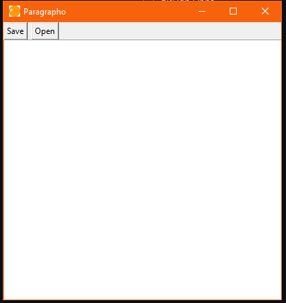

# About Paragrapho📝
Paragrapho is a simple, open-surce text editor written in Python.

## Images

## Downloads and other stuff

## Licensed under the GPLv3 license
See the [License](LICENSE.md)

###### made in 🇹🇩 with ❤️
